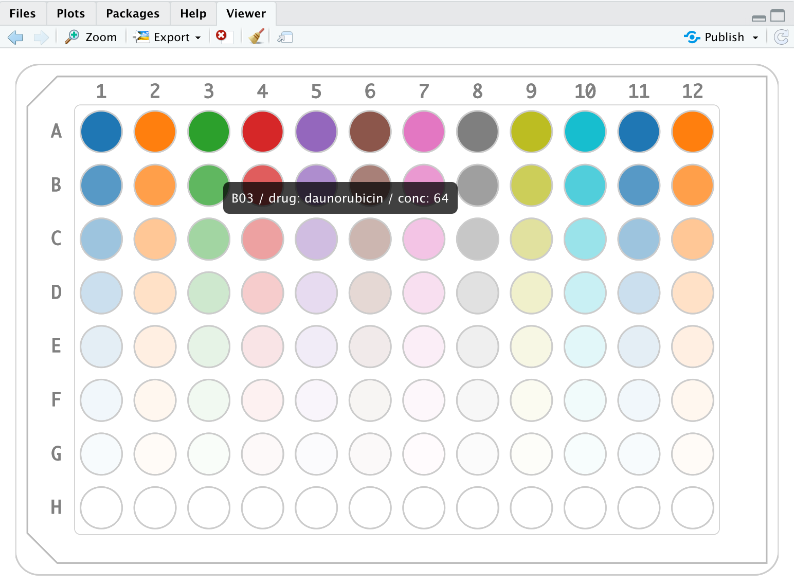

```{r setup, include=FALSE}
knitr::opts_chunk$set(echo = TRUE)
```

```{r, echo=FALSE}
suppressPackageStartupMessages(library(tidyverse))
library(mtpview1)
mtp_example1
```

View your data in place interactively with `mtp_view()`.
```{r, eval=FALSE}
# mtp_example1 %>% mtp_view()
# mtp_example1 %>% mtp_view(fillVar = "drug")
mtp_example1 %>% mtp_view(fillVar = "drug", fillOpacityVar = "conc")
```



Or, use `mtp_plot()` which is best for saving and printing and plays nice with `ggplot2`.

## One plate

```{r}
mtp_example1 %>% 
    mutate(plate = 1) %>% 
    mtp_ggplot(aes(plate = plate, well = well)) + 
    mtp_spec_96well() + 
    geom_footprint() + 
    geom_notched_border() +
    geom_col_label() + 
    geom_row_label() + 
    geom_well_rect(aes(fill = drug, alpha = conc))
```

## add lineplots

You can also add lineplots to if you have repeated measures for each well:

```{r}
library(tidyverse)
library(mtpview1)
mtp_example2 %>% 
    mutate(plate = 1) %>% 
    unnest() %>% 
    mtp_ggplot(aes(plate = plate, well = well)) + 
    mtp_spec_96well() + 
    geom_footprint() + 
    geom_notched_border() +
    geom_col_label() + 
    geom_row_label() + 
    geom_well_rect(aes(fill = cond)) + 
    geom_well_line(aes(x = runtime, y = measure))
```

Another example:

```{r}
mtp_example3 %>% 
    mutate(plate = 1) %>% 
    unnest() %>% 
    mtp_ggplot(aes(plate = plate, well = well)) + 
    mtp_spec_96well() + 
    geom_footprint() + 
    geom_notched_border() +
    geom_col_label() + 
    geom_row_label() + 
    geom_well_rect(aes(fill = drug, alpha = dose_um)) + 
    geom_well_line(aes(x = runtime, y = measure)) + 
    geom_well_text(aes(label = strain))
```

## Multiple Plates

```{r}
data <- mtp_example4 %>% 
    filter(run == 1) %>% 
    unnest()

plot <- data %>% 
    mtp_ggplot(aes(plate = plate, well = well)) + 
    mtp_spec_96well() + 
    geom_footprint(aes(fill = strain), alpha = 0.25) +
    geom_notched_border() +
    geom_col_label(size = 2) +
    geom_row_label(size = 2) +
    geom_well_rect(fill = "grey96", size = 0.1) +
    geom_well_line(aes(x = runtime, y = measure), size = 0.2) + 
    facet_wrap(~plate)
plot
```

## Roadmap


- [ ] unit testing and visual diff testing.
- [ ] cleaner interface that reduces duplication. Currently bandscales and placements are recomputed for each layer indepentently. This allows for max flexibility but this isn't necessarily worth it for the amount of complexity it introduces.
- [ ] dependencies: ggplot2, dplyr, tidyr, tibble... that's a lot...should attempt to minimize
- [ ] performance: eager, non-repetitive computer and straight to grid style?
