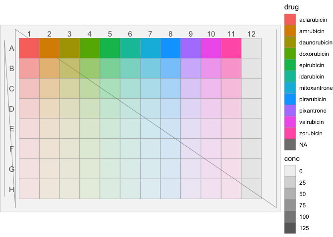
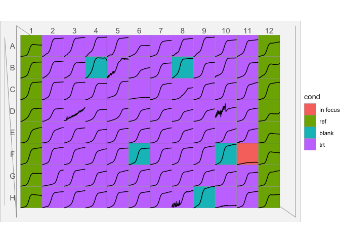
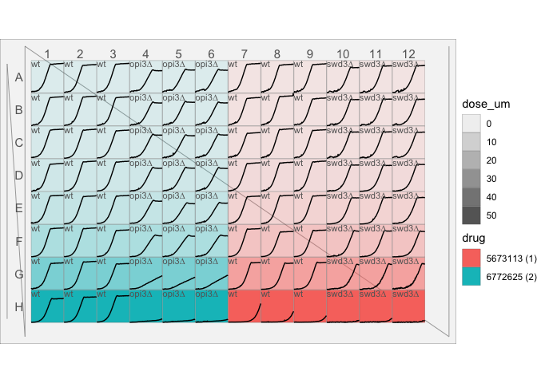
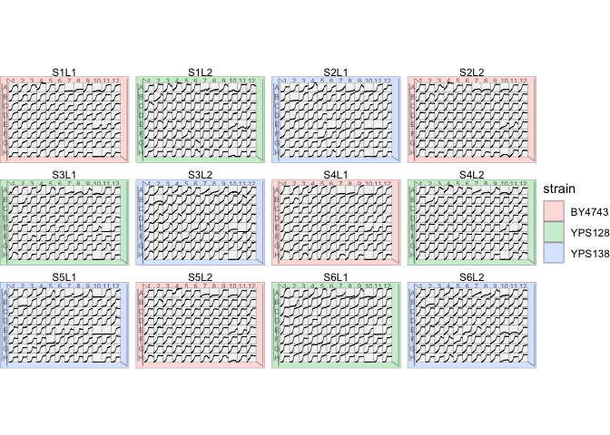

Easily view your microtitre plate data
================

    ## # A tibble: 96 x 3
    ##    well  drug          conc
    ##    <chr> <chr>        <dbl>
    ##  1 A01   aclarubicin    128
    ##  2 A02   amrubicin      128
    ##  3 A03   daunorubicin   128
    ##  4 A04   doxorubicin    128
    ##  5 A05   epirubicin     128
    ##  6 A06   idarubicin     128
    ##  7 A07   mitoxantrone   128
    ##  8 A08   pirarubicin    128
    ##  9 A09   pixantrone     128
    ## 10 A10   valrubicin     128
    ## # … with 86 more rows

View your data in place interactively with `mtp_view()`.

``` r
library(tidyverse)
# mtp_example1 %>% mtp_view()
# mtp_example1 %>% mtp_view(fillVar = "drug")
mtp_example1 %>% mtp_view(fillVar = "drug", fillOpacityVar = "conc")
```


Or, use `mtp_plot()` which is best for saving and printing and plays
nice with `ggplot2`.

## One plate

``` r
mtp_example1 %>% 
    mutate(plate = 1) %>% 
    mtp_ggplot(aes(plate = plate, well = well)) + 
    mtp_spec_96well() + 
    geom_footprint() + 
    geom_notched_border() +
    geom_col_label() + 
    geom_row_label() + 
    geom_well_rect(aes(fill = drug, alpha = conc))
```

<!-- -->

## add lineplots

You can also add lineplots to if you have repeated measures for each
well:

``` r
library(tidyverse)
library(mtpview1)
mtp_example2 %>% 
    mutate(plate = 1) %>% 
    unnest() %>% 
    mtp_ggplot(aes(plate = plate, well = well)) + 
    mtp_spec_96well() + 
    geom_footprint() + 
    geom_notched_border() +
    geom_col_label() + 
    geom_row_label() + 
    geom_well_rect(aes(fill = cond)) + 
    geom_well_line(aes(x = runtime, y = measure))
```

    ## Warning: `cols` is now required.
    ## Please use `cols = c(data)`

<!-- -->

Another example:

``` r
mtp_example3 %>% 
    mutate(plate = 1) %>% 
    unnest() %>% 
    mtp_ggplot(aes(plate = plate, well = well)) + 
    mtp_spec_96well() + 
    geom_footprint() + 
    geom_notched_border() +
    geom_col_label() + 
    geom_row_label() + 
    geom_well_rect(aes(fill = drug, alpha = dose_um)) + 
    geom_well_line(aes(x = runtime, y = measure)) + 
    geom_well_text(aes(label = strain))
```

    ## Warning: `cols` is now required.
    ## Please use `cols = c(data)`

<!-- -->

## Multiple Plates

``` r
data <- mtp_example4 %>% 
    filter(run == 1) %>% 
    unnest()
```

    ## Warning: `cols` is now required.
    ## Please use `cols = c()`

``` r
plot <- data %>% 
    mtp_ggplot(aes(plate = plate, well = well)) + 
    mtp_spec_96well() + 
    geom_footprint(aes(fill = strain), alpha = 0.25) +
    geom_notched_border() +
    geom_col_label(size = 2) +
    geom_row_label(size = 2) +
    geom_well_rect(fill = "grey96", size = 0.1) +
    geom_well_line(aes(x = runtime, y = measure), size = 0.2) + 
    facet_wrap(~plate)
plot
```

<!-- -->

## Roadmap

  - \[ \] unit testing and visual diff testing.
  - \[ \] cleaner interface that reduces duplication. Currently
    bandscales and placements are recomputed for each layer
    indepentently. This allows for max flexibility but this isn’t
    necessarily worth it for the amount of complexity it introduces.
  - \[ \] dependencies: ggplot2, dplyr, tidyr, tibble… that’s a
    lot…should attempt to minimize
  - \[ \] performance: eager, non-repetitive computer and straight to
    grid style?
